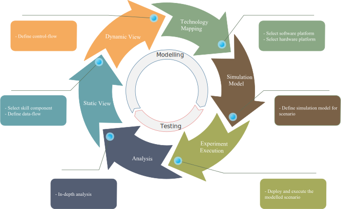

  <h1>Modeling Development Process</h1>

### Workflow: Modelling

In order to create a scenario, the **Experiment Designer, Technical Architect, Safety Engineer, etc.** need to model the different aspects that are required for the particular scenario.

1. The **Experiment Designer** creates a platform independent model of the scenario:
    1. the **Static View**{: style="color:#68a3ab;"} is defined by choosing skill components (i.e. controller, etc.) from the [CogIMon Component Library (CCL)](/ccl/overview.html) and defining the data-flow between those.
    2. defining the control-flow for the scenario covers the **Dynamic View**{: style="color:#f5ab5e;"} of the system.
2. Next the **Technical Architect** maps the independent model to a chosen platform:
    1. W.r.t. the **Technology Mapping**{: style="color:#8aa885;"}, a software platform needs to be chosen and configured properly (e.g., Orocos RTT).
    2. For the execution on a hardware platform (simulation or real one), a robot platform need to be chosen (e.g., KUKA LWR 4+).
3. A **Simulation Model**{: style="color:#7a6147;"} defines the scenario setup for the simulation.
4. Further aspects may be addressed by different experts, such as a **Safety Engineer, etc.**

The aforementioned steps may be iterated (independently) as necessary to produce a model that is ready for testing in simulation.

### Workflow: Testing

Once the model of the scenario is ready, the necessary artifacts are generated to test it in simulation.

1. In this case the Orocos Program Script is produced and launched by the Orocos environment together with the Gazebo simulation to start the **Experiment Execution**{: style="color:#a6ab5c;"} of the modeled scenario.
2. The recorded data from the experiment simulation needs to be evaluated in an in-depth **Analysis**{: style="color:#545e73;"} to spot flaws in the model and improve those by re-iterating the workflow.
3. If the modeled scenario performs as expected in the simulation, it can be deployed and executed in the real hardware platform. This is not yet done in this example.

<!-- 

 -->

